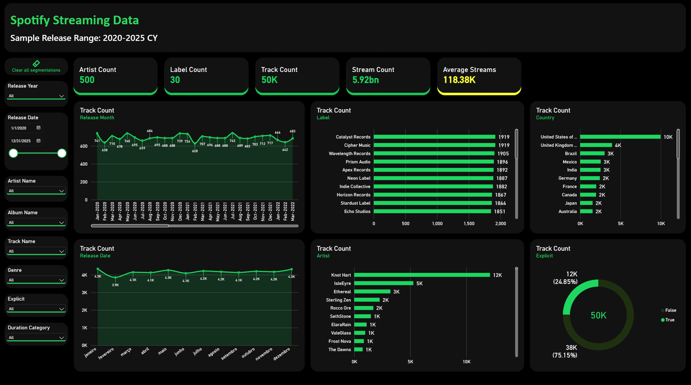
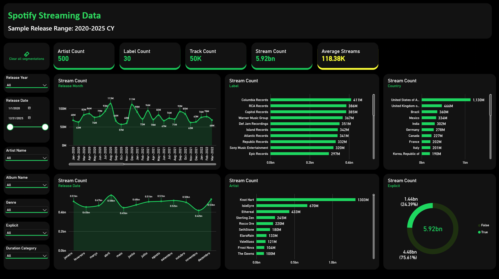
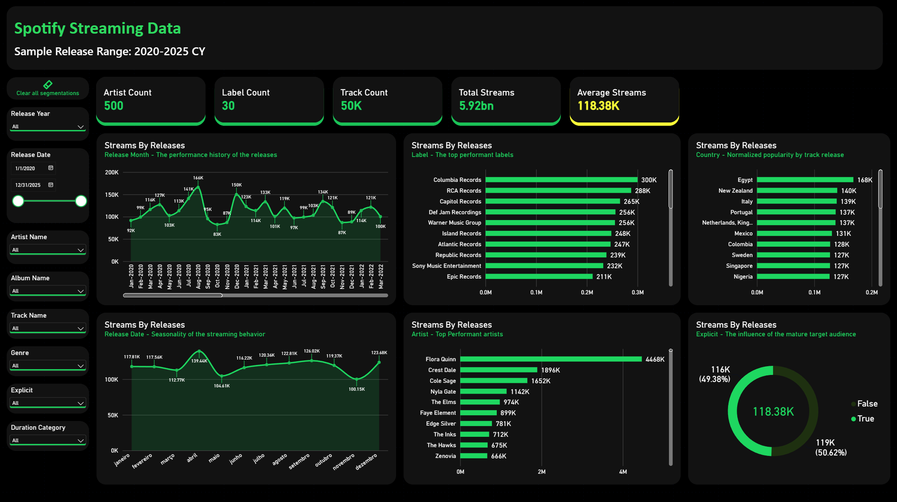

# Project Summary
This is an example of a simple data analysis on synthetic data to simulate Spotify Music Streaming Behavior, there is basically no need to run the python scripts since they serve only to demonstrate basic data cleanup methods, as for the PowerBI dashboard, it is connected to the CSV file in the bronze layer folder, and any data processing on that file is made directly inside PowerQuery and DAX formulas.

Since this is a public repository, you only need to download the .pbix file for it to work. s

## Installation & Setup

This project uses [uv](https://docs.astral.sh/uv/#highlights) for fast, reliable Python dependency management.

### Using `uv` (Recommended & Fastest)

If you don't have `uv` installed yet, install it via curl or your package manager:
```bash
# macOS/Linux
curl -LsSf https://astral.sh | sh

# Windows
powershell -c "irm https://astral.sh | iex"
```

Once `uv` is installed, clone the repository and sync the project. This will automatically create a virtual environment and install the exact locked dependencies:

```bash
git clone https://github.com/Guzmarai/spotify-stream-analysis.git
cd spotify-stream-analysis
uv sync
```

To run your application or scripts within this managed environment:
```bash
uv run main.py
```

## Gallery

### Page 1: Track Release Count

The idea here was to measure Track release on different dimensions, simple but effective to understand what are the characteristics of most of the tracks released.

### Page 2: Streaming Count

The idea here was to measure the count of times some listened to the songs. It's also effective to understand what are the characteristics of the most popular tracks.

### Page 3: Streaming per Track Count

The idea here was to normalize the dimensions popularity, since the number of tracks released can overestimate the popularity on a specific country, label, artist or album, that's a better way to compare the average popularity for each analysis dimension
